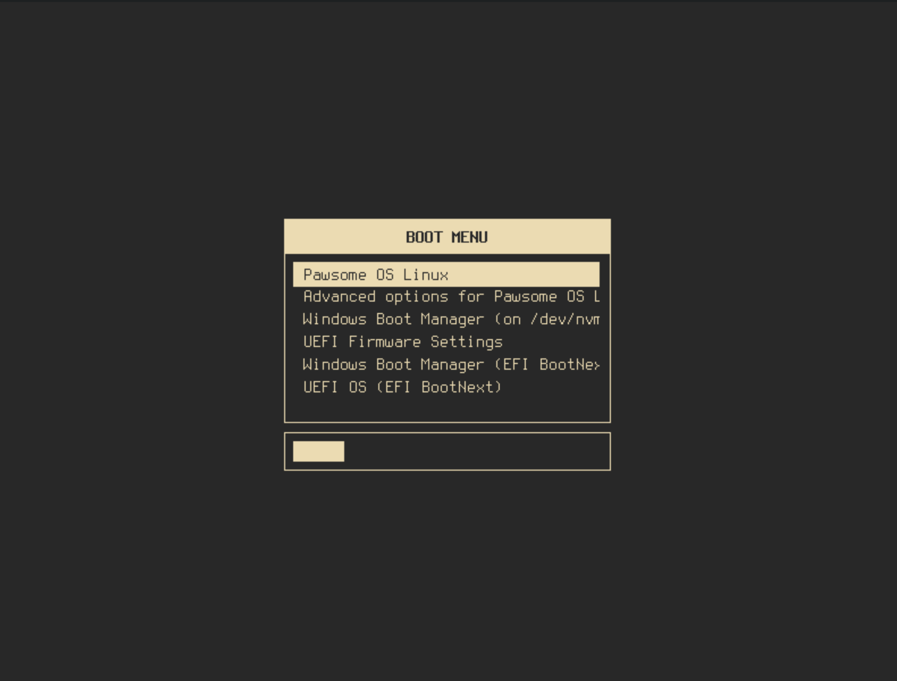

# Gruvbox GRUB Theme

A minimalistic, terminal-inspired Gruvbox theme for GRUB.



## How to use

### Install theme

Copy the `gruvbox` theme folder into your system's GRUB themes directory:

```bash
sudo mkdir -p /boot/grub/themes
sudo cp -r gruvbox /boot/grub/themes/
```

### Select theme

Edit GRUB config `/etc/default/grub` by adding following line

```bash
GRUB_THEME="/boot/grub/themes/gruvbox/theme.txt"
```

### Update GRUB

Dependign on your distro you might need to look it up by yourself.
Here is how you can do it for some of them:
* **Arch:** `sudo grub-mkconfig -o /boot/grub/grub.cfg`
* **Debian / Ubuntu:** `sudo update-grub`
* **Fedora / RHEL:** `sudo grub2-mkconfig -o /boot/grub2/grub.cfg`
